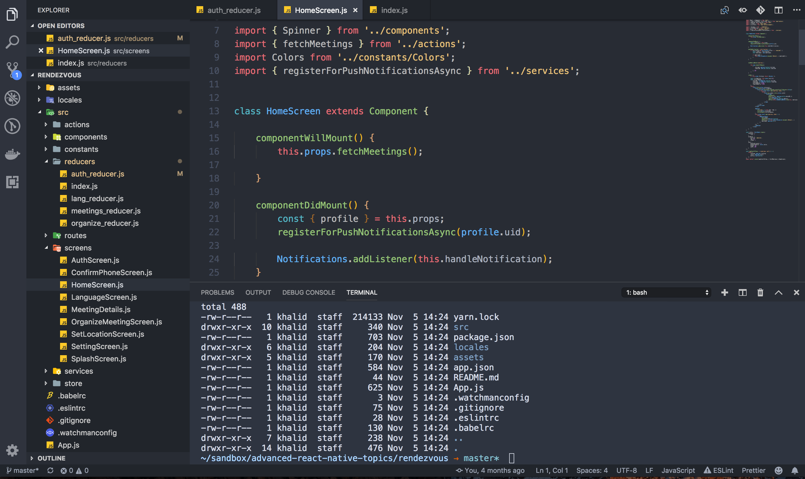

# ABOLKOG Theme

A [VSCode](https://code.visualstudio.com/) theme (Dark and Light themese).


## Dark Theme
Dark theme and terminal ScreenShot (JavaScript)



## Light Theme
Light theme and terminal ScreenShot  (JavaScript)


 based on  and other themese combind

Light Theme with Dark Terminal

## Installation
* The theme is aviable on the [VSCode Market Place](https://marketplace.visualstudio.com/items?itemName=abolkog.vscode-abolkog-light)

* You can also install it via the following command

```
ext install abolkog.vscode-abolkog-light
```


## Credit
* Dark Theme: The Dark theme is based on [One Monokai](https://github.com/azemoh/vscode-one-monokai)
* Light Theme: The ligth theme is based on [GitHub Plus Theme](https://github.com/thenikso/github-plus-theme).


## Issues and Bugs
Please use the [GitHub Issues page](https://github.com/abolkog/vscode-abolkog-light/issues) to report any problem or requests modifications
